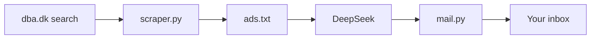

# finder

Searches [dba.dk](https://www.dba.dk), filters the ads with an LLM, and emails the matches.



## Scripts

- `scraper.py` - scrapes dba.dk, keeps ads whose title contains the query, prints `title | price | url | description`.
- `filter_prompt.txt` - prompt that tells DeepSeek which ads to keep.
- `mail.py` - emails the filtered results (reads stdin).
- `.github/workflows/finder.yml` - runs the above daily.

## Run locally

```bash
uv run scraper.py

cat filter_prompt.txt ads.txt > prompt.txt
curl -sS https://api.deepseek.com/chat/completions \
  -H "Authorization: Bearer $DEEPSEEK_API_KEY" \
  -H "Content-Type: application/json" \
  -d "$(jq -n --rawfile p prompt.txt '{model:"deepseek-chat",messages:[{role:"user",content:$p}]}')" \
  | jq -r '.choices[0].message.content' > result.txt

uv run mail.py < result.txt  # needs SMTP_HOST, SMTP_USER, SMTP_PASSWORD, MAIL_FROM, MAIL_TO
```
