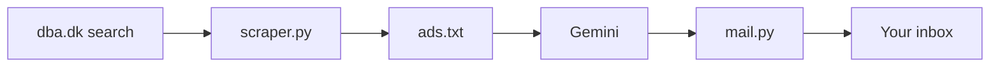

# finder

Searches [dba.dk](https://www.dba.dk), filters the ads with an LLM, and emails the matches.



## Scripts

- `scraper.py` - scrapes dba.dk, keeps ads whose title contains the query, prints `title | price | url | description`.
- `filter_prompt.txt` - prompt that tells Gemini which ads to keep.
- `mail.py` - emails the filtered results (reads stdin).
- `.github/workflows/finder.yml` - runs the above every Saturday.

## Run locally

```bash
uv run scraper.py

cat filter_prompt.txt ads.txt > prompt.txt
curl -sS https://generativelanguage.googleapis.com/v1beta/models/gemini-2.0-flash:generateContent \
  -H "x-goog-api-key: $GEMINI_API_KEY" \
  -H "Content-Type: application/json" \
  -d "$(jq -n --rawfile p prompt.txt '{contents:[{parts:[{text:$p}]}]}')" \
  | jq -r '.candidates[0].content.parts[0].text' > result.txt

uv run mail.py < result.txt  # needs SMTP_HOST, SMTP_USER, SMTP_PASSWORD, MAIL_FROM, MAIL_TO
```
